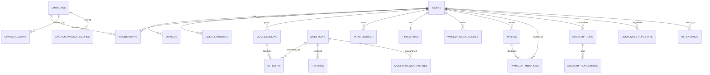

# 14. 서버 개발(백엔드/인프라)

> ⚠️ **구현 스택 갱신(2026-07-12):** v1은 이 문서의 Kotlin+Spring 대신 **GCP + Firebase 서버리스**로 구현하기로 결정했습니다(`../adr/ADR-001-gcp-firebase.md`). 아래의 **데이터 모델·리더보드 산식·포인트 원장·안티치트 원칙·NFR은 그대로 유효**하며, 구현 매핑만 치환됩니다: Postgres→Firestore, Spring 서비스→Cloud Functions(TypeScript), Redis ZSET→주간 집계 스냅샷(+필요 시 Memorystore).

> **한 줄 목적:** 중장년 사용자가 큰 글씨로 부담 없이 퀴즈를 푸는 동안, "우리 교회를 위해" 조작하고픈 강한 사회적 유인 속에서도 **서버가 권위(server-authority)를 가지고 점수·티어·리더보드를 위조 불가능하게 계산·집계**하고, 종교(민감정보)·저작권·결제를 법적으로 안전하게 처리하며, 월요일 00시 리셋 피크에도 순위→공유 루프가 끊기지 않게 하는 백엔드/인프라를 정의한다.

---

## 14.0 문서 스코프 · 설계 원칙 매핑

이 문서는 v1.0 MVP(T+10주)의 서버를 구현·운영 가능한 수준으로 규정한다. 각 서버 결정은 PRD 제품 원칙과 정합해야 한다.

| PRD 제품 원칙 | 서버가 지는 책임 |
|---|---|
| 매일의 습관에 얹는다 | 무제한 세션(하트/제한 없음) → **읽기·채점 경로의 저지연·고가용**. 출석·오늘의말씀·스트릭을 서버시간 기준으로 신뢰성 있게 집계 |
| 명예로 경쟁한다(현금성 아님) | 점수·티어·리더보드가 **위조되면 유일 차별점이 붕괴** → 서버 권위 채점 + 안티치트가 최우선 비기능 요구. **광고 시청(F5 보상형 2배)·신고 보상 등 비-경쟁 유래 가산분이 리더보드를 오염시키지 않도록 집계 분리**(14.7.6) |
| 교회가 팀이다 | 상위20 합산·규모리그·기여 귀속을 **정확·공정**하게. 교회 병합/분립/변경/홉핑 엣지케이스까지 규칙화 |
| 중장년이 기본값이다 | 안티치트 **오탐 최소화**(정직한 권사님의 빠른 응답을 죽이지 않음), CS·계정복구를 사람이 도울 수 있는 구조, 닉네임 기본(실명 강제 금지) |

MVP 서버 스코프: F1 채점/포인트, F2 티어, F3 리더보드(개인+교회), F4 교회 검색/등록, F5 구독 영수증검증, 출석, F8 초대 귀속/유효초대/상한, F9 신고+자동격리(자동검증 파이프라인은 v1.1이지만 **격리 트리거·검수 큐 스키마는 v1에서 확정**), 인증/세션/보안, 관측성, 백업/DR. **F5 보상형 광고 2배 포인트 자체는 v1.1이나, 리더보드 오염 방지를 위한 원장/집계 분리 플래그는 v1 스키마에 선반영**(14.7.6).

---

## 14.1 아키텍처 — 모듈러 모놀리스 우선

### 14.1.1 결정: 단일 배포 모놀리스 + 분리된 워커 프로세스

**권고:** 모듈러 모놀리스(Modular Monolith). API 서버 1개 배포 단위 + 비동기 워커 1개 배포 단위. 마이크로서비스로 시작하지 않는다.

**논거(구체 수치 기반):**
- 예상 부하가 작다. 100k MAU × DAU/MAU 25% = **DAU ~25,000**. 평균 40문항/DAU 가정 시 **채점 요청 ~100만/일 = 평균 11.6 req/s**, 저녁·새벽 피크 3~5배여도 **~60 req/s**. 단일 Postgres + Cloud Run 2~4 인스턴스로 충분. 마이크로서비스의 네트워크·운영 오버헤드를 정당화할 규모가 아니다.
- 10주 MVP에서 서비스 경계 오판 비용이 크다. 도메인 경계가 아직 유동적(교회 정체성·초대 정책·안티치트 임계 모두 파일럿에서 튜닝).
- **트랜잭션 일관성이 핵심**이다. 포인트 원장 기재 + 티어 갱신 + 리더보드 인덱스 반영이 원자적이어야 하는데, 분산 트랜잭션은 리스크. 단일 DB 트랜잭션이 가장 안전하다.
- 팀 규모가 작다(전제). 온콜·배포 파이프라인을 여러 개 운영할 여력 부담.

**모듈 경계(패키지/모듈로 분리, 배포는 통합):** 모듈 간 호출은 인터페이스 경유, DB 테이블 소유권을 모듈별로 명확히 하여 **미래에 서비스로 뜯어낼 수 있게** 설계한다.

| 모듈 | 소유 테이블(주) | 향후 분리 우선순위 |
|---|---|---|
| `identity` | users, devices, auth_sessions, user_consents | 낮음 |
| `quiz` | questions, question_versions, quiz_sessions, attempts, user_question_stats | 중 |
| `scoring` | point_ledger, tier_states, attendance | 낮음(quiz와 트랜잭션 강결합) |
| `leaderboard` | weekly_user_scores, church_weekly_scores, leaderboard_snapshots | **높음**(Redis 집약, 배치 무거움) |
| `church` | churches, memberships, church_claims | 중 |
| `invite` | invites, invite_attributions | 중 |
| `trust`(F9) | reports, question_quarantines, moderation_queue | **높음**(LLM 오케스트레이션·SLA 워커) |
| `billing` | subscriptions, subscription_events | 중 |
| `notification` | notification_log, push_schedules | 중 |
| `admin`/`b2b` | audit_log, b2b_consent_scope | 중 |

### 14.1.2 프로세스 토폴로지

```
[모바일] --HTTPS--> [API 서버(Cloud Run, stateless, N인스턴스)]
                          |         |            |
                    [Postgres]  [Redis]   [Cloud Tasks/Pub-Sub]
                                                 |
                          [Worker(Cloud Run job/컨테이너)]
                            - F9 격리/LLM검증/SLA
                            - 주간 스냅샷/리셋
                            - 결산카드·푸시 staggered 발송
                            - IAP 웹훅 처리·재검증
                            - 원장 정합성 리컨실
[App Store/Play] --웹훅--> [API의 /internal/webhooks/*] --enqueue--> [Worker]
[Cloud Scheduler] --cron--> [Worker jobs]
```

API 서버는 완전 stateless(세션은 Redis/JWT). 워커는 idempotent 잡. 리더보드 실시간 인덱스 갱신은 API 요청 경로에서 트랜잭셔널 아웃박스로 처리(14.8).

---

## 14.2 기술 스택 권고

| 레이어 | 권고 | 근거 / 대안 |
|---|---|---|
| 언어/런타임 | **Kotlin + JVM 21(가상 스레드)** | 원장·정합성에 강한 정적 타입, Spring Batch로 배치 성숙, 국내 채용 풀 큼. **대안:** 팀이 JS 중심이면 TypeScript + NestJS(속도 우위, 배치는 별도 워커로 보완) |
| 웹 프레임워크 | **Spring Boot 3.x (MVC + 가상 스레드)** | WebFlux(리액티브)는 팀 러닝커브 대비 이득 적음. 부하가 낮아 명령형 + 가상 스레드로 충분 |
| 주 DB | **PostgreSQL 16** | 원장 ACID, 파티셔닝(attempts 월별), `pg_trgm`(교회명 검색), JSONB(문제 choices/메타), 논리복제. Cloud SQL for PostgreSQL(HA) |
| 캐시/랭킹 | **Redis 7 (Memorystore HA)** | Sorted Set = 리더보드 O(logN), 레이트리밋 토큰버킷, 서브 토큰 nonce, 세션 |
| 큐/비동기 | **Cloud Tasks(작업) + Pub/Sub(팬아웃/RTDN)** | 관리형, 재시도·DLQ 내장. Play RTDN이 Pub/Sub 네이티브. 경량 이벤트는 Redis Streams 병행 가능 |
| 스케줄러 | **Cloud Scheduler** | cron → 워커 트리거(주간 리셋/결산/리컨실) |
| 오브젝트 스토리지 | **GCS** | 스냅샷 아카이브, 공유카드 원본, 백업, 문제 이미지 |
| 데이터 웨어하우스 | **BigQuery** | 이벤트 택소노미 싱크, KPI, B2B 집계(data 파트 공용) |
| 클라우드/리전 | **GCP · asia-northeast3(서울)** | Firebase(FCM)·AdMob·GA4가 Google 생태계 → 국외이전·연동 최소화. 국내 리전으로 레이턴시·데이터 소재 유리. **대안:** AWS ap-northeast-2(팀 숙련 시) |
| 마이그레이션 | **Flyway** | 버전드 마이그레이션, expand-contract 무중단 |
| LLM 검증기(F9) | **Anthropic Claude API** | 구조화 판정(JSON) 신뢰성. 서버→외부 = 국외이전 고지 대상(14.15) |
| 컨테이너/배포 | Cloud Run + GitHub Actions(CI/CD) | 오토스케일, 콜드스타트는 min-instances로 완화 |

**결정 근거 요약:** "속도(velocity)"보다 "정합성·집계 신뢰성"이 이 제품의 사활이다(명예 리더보드가 유일 차별점). 그래서 정적 타입 JVM + 단일 ACID DB를 1순위로 둔다.

---

## 14.3 환경 · 배포 토폴로지

| 환경 | 용도 | 데이터 | IAP/광고 |
|---|---|---|---|
| `dev` | 개발 | 합성 데이터 | 스토어 샌드박스 |
| `staging` | QA/부하테스트/파일럿 리허설 | 익명화 스냅샷 | 샌드박스 |
| `prod` | 운영 | 실데이터(민감정보 암호화) | 라이브 |

- 파일럿(협력교회 3~5곳)은 **prod의 피처플래그**로 오픈(별도 환경 아님) — 밸런스/파밍 실측이 목적이므로 실환경 필요.
- 모든 환경 분리 IAM·시크릿(Secret Manager). prod 접근은 audit_log.

---

## 14.4 데이터 모델 · ERD

### 14.4.1 ERD (핵심)



### 14.4.2 주요 테이블 · 필드

**users**

| 필드 | 타입 | 비고 |
|---|---|---|
| id | uuid PK | 내부 식별자 |
| kakao_sub | text UNIQUE | 카카오 고유 sub(로그인 anchor, 기기변경 무관 동일 계정 보장) |
| display_name | text | **닉네임(실명 아님, 기본값)** — 전국 공개 리더보드 노출 필드 |
| birth_year | smallint | 연령 게이트(만14세 미만 차단, 14.15) |
| difficulty_band | enum(easy/normal/hard) | 온보딩 진단 결과 |
| status | enum(active/dormant/withdrawn) | 탈퇴=withdrawn(익명화 후) |
| big_font_pref | bool | 큰글씨(design 연동) |
| leaderboard_public | bool | 종교 민감정보 공개 별도 동의 결과(default false→온보딩 동의 시 true) |
| created_at, last_active_at | timestamptz(UTC) | |

**devices** (기기지문·안티치트·초대 어뷰징 핵심)

| 필드 | 타입 | 비고 |
|---|---|---|
| id | uuid PK | |
| user_id | uuid FK | |
| device_fingerprint_hash | text | 클라 수집(동의 하) 지문의 **서버 해시**(솔트) |
| platform | enum(ios/android) | |
| model, os_version | text | 저사양·구형 대응 지표 |
| push_token | text | FCM |
| att_status | enum(authorized/denied/unknown) | iOS ATT |
| integrity_verdict | enum(pass/fail/unknown) | Play Integrity/App Attest |
| first_seen, last_seen | timestamptz | 계정군집 탐지 |

**churches**

| 필드 | 타입 | 비고 |
|---|---|---|
| id | uuid PK | |
| name, address, region_code(시도/구군) | text | region_code로 리더보드 시도 탭·동명교회 구분 |
| lat, lng | double | 장소검색 기반 |
| size_league | enum(seed 1-9 / mid 10-49 / large 50+) | member_count로 재계산(캐시) |
| member_count_cached | int | 사회적 증거 "N명 성도" |
| status | enum(seeded/pending/active/closed/merged) | 직접등록=pending(검수큐) |
| canonical_church_id | uuid null | **병합 시 대표 레코드 포인터**(14.14) |
| verified | bool | 사전시딩=true |
| created_by | uuid null | 직접등록자 |

**memberships**

| 필드 | 타입 | 비고 |
|---|---|---|
| id, user_id, church_id | | |
| is_current | bool | 현재 소속 1개 |
| joined_at, left_at | timestamptz | |
| change_count, last_change_at | | **교회변경 월1회** 서버 강제 |

**questions**

| 필드 | 타입 | 비고 |
|---|---|---|
| id | uuid PK | |
| category | enum(ot/nt/person/place_event/mixed) | |
| difficulty | enum(easy/normal/hard) | 포인트 10/15/25 결정 |
| body | text | 문제(내용이해형, 자구암송 금지) |
| choices | jsonb(4) | 4지선다 |
| answer_index | smallint | **정답(서버만 보유, serve 시 미전송)** |
| explanation | text | 정답 해설 |
| scripture_ref | text | 근거구절 주소(예: "요 3:16") — **필수** |
| scripture_text | text null | 개역개정 원문 — **저작권 라이선스 확정 전엔 NULL/미전송**(legal 블로커, 14.20/의존성). 오늘의말씀 일일구절도 동일 게이트·번역본(개역개정) 적용 |
| status | enum(draft/active/quarantined/retired) | 격리=즉시 서빙 제외 |
| version | int | 감사용(question_versions에 이력) |
| times_served, times_correct | bigint | **raw correct_rate(=times_correct/times_served)** 산출 소스 — 격리·재라벨 단일 지표(14.11.1) |
| distractor_pick_counts | jsonb | 특정 오답 쏠림 탐지 |

**attempts** (파티션: server_ts 월별)

| 필드 | 타입 | 비고 |
|---|---|---|
| id | uuid PK | = 클라 생성 **attempt_id(멱등키)** |
| user_id, session_id, question_id | | |
| church_id_snapshot | uuid null | **채점 시점 소속 교회 고정**(기여 귀속·홉핑 방어) |
| week_id | text | 예 "2026-W29"(KST 주경계) — 리더보드 집계 파티션 |
| selected_index | smallint | |
| is_correct | bool | **서버 판정** |
| awarded_points | int | **서버 계산**(재출제/콤보 반영) |
| combo_multiplier | numeric | 서버 세션 상태 기반 |
| served_at, answered_at | timestamptz | **둘 다 서버 기준**(serve 토큰) |
| latency_ms | int | answered_at − served_at (서버 계산) |
| invalidated | bool, invalidation_reason | 매크로/속도 위반 무효화 |

**point_ledger** (append-only, 절대 UPDATE/DELETE 금지)

| 필드 | 타입 | 비고 |
|---|---|---|
| id | bigserial PK | |
| user_id | uuid | |
| entry_type | enum(quiz_correct / combo_bonus / attendance / **rewarded_bonus** / report_reward / reversal / adjustment) | **rewarded_bonus** = F5 보상형 광고 2배 시청으로 발생한 **배율 가산분**(기본 포인트와 분리 기재, v1.1) |
| points | int | 음수 가능(reversal) |
| leaderboard_eligible | bool | **주간 리더보드(개인 nat/reg/ch·교회 top20) 집계 반영 여부.** quiz_correct·combo_bonus·attendance=true; **rewarded_bonus·report_reward=false**(티어 누적엔 반영, 리더보드 집계 제외 — 14.7.6). reversal은 원 엔트리 값 상속 |
| ref_type, ref_id | | 원천(attempt/attendance/report) |
| week_id | text | (report_reward·rewarded_bonus도 week_id는 기록하되 leaderboard_eligible=false로 집계 필터에서 배제) |
| balance_after | bigint | 누적(정합성 리컨실 대상) |
| reversal_of | bigint null | 무효화 대상 원장 id |
| server_ts | timestamptz | |

**tier_states**: user_id PK, cumulative_points, current_tier(enum 겨자씨/등불/감람나무/나팔/방패/면류관), tier_reached_at. **하락 없음** → cumulative는 단조 증가(reversal은 아직 미확정 포인트에만; 확정된 티어는 유지, 14.7.5). **cumulative는 leaderboard_eligible 여부와 무관하게 전 엔트리 합산**(보상형·신고보상도 개인 누적/티어엔 반영, 14.7.6).

**weekly_user_scores** (스냅샷/집계): user_id, week_id, church_id, points, rank_national, rank_region, rank_church, computed_at. (주간 확정 시 프리즈. **points = leaderboard_eligible=true 엔트리만 합산**)

**church_weekly_scores**: church_id, week_id, top20_sum, contributor_count, size_league, rank_league, rank_overall. (top20_sum은 개인 주간 leaderboard_eligible 점수 상위20 합 → 보상형·신고보상 유래 가산분 자동 제외)

**invite_attributions** (상태머신 14.10): id, invite_id, invitee_user_id, invitee_device_fp_hash, state(pending/joined/church_registered/qualified/rejected), qualified_at, credit_date(일일 상한 버킷), rejection_reason.

**subscriptions**: id, user_id, platform, product_id, original_transaction_id/purchase_token, status(active/grace/expired/refunded/revoked), current_period_end, auto_renew, environment(prod/sandbox), latest_receipt_ref.

**user_consents** (PIPA 제23조 근거·감사): id, user_id, consent_type(religion_sensitive / leaderboard_public / b2b_use / marketing_push / night_push / cross_border / att), version, granted/revoked, granted_at, evidence(ip, ua, screen_id).

**audit_log**: actor(user/admin/system), action, entity, entity_id, before/after(jsonb), server_ts — 민감정보 접근·관리자 작업·B2B 추출 전수 기록.

---

## 14.5 핵심 API 계약

원칙: REST/JSON, `/v1`, JWT Bearer, 모든 쓰기 API는 `Idempotency-Key`(또는 도메인 멱등키). 시각은 UTC 저장·KST 표기, 응답에 서버 계산값만.

> **API 계약 단일 소스(공동 저작):** 엔드포인트 경로·명칭·스키마는 **OpenAPI 스펙을 유일 소스로 client·server가 공동 확정**(착수 전). 서버 정본 명칭: 채점=`/v1/quiz/attempts`(client의 `quiz/answer` 아님), 초대=`/v1/invites/accept`·`/v1/invites/me`(client의 `invite/attribute`·`invite/status` 아님). **client가 전제하는 `quiz/offline-pack`·`quiz/answers/batch`(로컬 정답키/오프라인팩) 엔드포인트는 v1 서버 계약에 없음**(14.7.1 안티치트 불변식 위배). 푸시토큰 등록 등 추가 엔드포인트가 필요하면 OpenAPI에 명시 추가 후 착수.

| 메서드·경로 | 용도 | 인증 | 멱등 | 핵심 계약 |
|---|---|---|---|---|
| POST `/v1/auth/kakao` | 카카오 로그인 | 없음(카카오 토큰) | — | 카카오 access token 검증 → user upsert → {access_jwt(15m), refresh(30d)} |
| POST `/v1/auth/refresh` | 토큰 갱신 | refresh | — | 회전(rotation) |
| GET `/v1/me` | 프로필 | JWT | — | 티어/소속교회/구독상태 |
| PATCH `/v1/me/consents` | 동의 변경 | JWT | — | 동의 이력 기록 |
| DELETE `/v1/me` | **회원탈퇴** | JWT | — | 유예 큐 등록(14.16) |
| GET `/v1/quiz/next?category=&count=10` | **문제 배치 서빙** | JWT | — | answer_index 미포함. 각 문항에 **serve_token**(HMAC) 동봉. 배치 서빙으로 왕복↓·오프라인 버퍼(무정답 프리페치) 지원 |
| POST `/v1/quiz/attempts` | **정답 제출·채점** | JWT | Y(attempt_id) | 아래 상세. 정오(is_correct)는 **이 응답에서만** 확정 |
| POST `/v1/quiz/sessions/{id}/complete` | 세션 종료 | JWT | Y | 20문항 광고 트리거·세션 무결성 최종판정 |
| GET `/v1/leaderboard/personal?scope=national\|region\|church&period=weekly\|cumulative` | 개인 순위 | JWT | — | 내 순위 상단고정(rank, percentile) + top N |
| GET `/v1/leaderboard/church?league=all\|seed\|mid\|large` | 교회 대항 | JWT | — | 규모리그 + 통합 병행 |
| GET `/v1/churches/{id}` | 교회 상세 | JWT | — | 순위추이/기여자TOP20/참여인원 |
| GET `/v1/churches/search?q=&region=` | 교회 검색 | JWT | — | pg_trgm, 동명 지역표기 구분 |
| POST `/v1/churches` | 직접등록 폴백 | JWT | — | status=pending, 검수큐 |
| POST `/v1/me/church` | 소속 등록/변경 | JWT | — | **월1회 쿨다운** 검사 |
| POST `/v1/churches/{id}/claim` | 교회 클레임 | JWT | — | 대표자 정정 요청→검수(14.14) |
| GET `/v1/invites/me` | 초대 현황 | JWT | — | 코드/누적/유효진행(대기중 표시) |
| POST `/v1/invites/accept` | 초대 수락 | JWT | Y | deeplink id 또는 6자리코드 |
| POST `/v1/reports` | 오류신고 | JWT | Y | 원탭 사유코드 |
| POST `/v1/attendance/check-in` | 출석 | JWT | Y(date) | **서버시간** 기준 스트릭 |
| POST `/v1/billing/verify` | 영수증검증 | JWT | Y | 아래 14.12 |
| POST `/internal/webhooks/appstore` | ASSN v2 | 서명검증 | — | 워커 enqueue |
| POST `/internal/webhooks/googleplay` | Play RTDN | Pub/Sub push | — | 워커 enqueue |

### 14.5.1 채점 API 상세 (가장 중요한 계약)

```
POST /v1/quiz/attempts
{
  "attempt_id": "uuid(클라 생성, 멱등키)",
  "session_id": "uuid",
  "question_id": "uuid",
  "serve_token": "HMAC 토큰(서버가 next에서 문항별로 발급 → client가 캡처·반환)",
  "selected_index": 2
}
```
서버 처리(단일 트랜잭션):
1. `serve_token` HMAC 서명 검증 + payload{question_id, session_id, user_id, served_at_server, nonce} 일치 확인. **문항별 serve_token이 유일 안티치트 바인딩**(14.6).
2. Redis에서 nonce 소비(재전송 방지, TTL 10분). 이미 소비 → 409/멱등 반환.
3. `answered_at = now(server)`, `latency_ms = answered_at − served_at_server`. **클라 타임스탬프는 신뢰하지 않음.**
4. `answer_index`와 대조 → is_correct.
5. 포인트 서버 계산: 재출제(과거정답)면 규칙 적용, 신규정답이면 난이도별 10/15/25, 콤보(세션 서버상태) 5연속+10%/10연속+25%.
6. 매크로 방어: latency<1500ms가 세션 내 반복 임계 초과 → 세션 integrity 하락, 세션포인트 무효 후보.
7. attempts INSERT + point_ledger INSERT + tier 재계산(전 엔트리 누적) + **아웃박스에 리더보드 갱신 이벤트(leaderboard_eligible 델타만)** — 모두 같은 트랜잭션(14.8.2).
8. 응답:
```
{
  "is_correct": true,
  "awarded_points": 15,
  "combo_multiplier": 1.1,
  "explanation": "...",
  "scripture_ref": "요 3:16",
  "scripture_text": null   // 라이선스 확정 후 채움
}
```
멱등: 동일 attempt_id 재요청 시 **재채점 없이 최초 결과 반환**.

> **정오 피드백 타이밍(client·ux·design 정합):** is_correct는 이 채점 응답으로만 확정된다. `/quiz/next`에 정답이 없으므로 **탭 즉시 로컬 정오(색·햅틱) 표시는 온라인 기본모드에서 불가** — 선택 즉시 중립 프레스 → **채점 응답(p95<250ms) 이후** 정오 햅틱/색·근거구절 표시로 정정해야 한다. '낙관적 UI'는 포인트·리더보드 표기에만 한정하고 퀴즈 정오에는 적용하지 않는다(ux 12.3.2/12.7·design 11.6.2 정정 대상). 오프라인(로컬 정답키 없음)에서는 정오 미표시 → 재연결 시 서버 채점(14.7.1).

---

## 14.6 인증 · 세션 · 보안

- **로그인:** 카카오 단일(+Apple 심사요건은 client/legal). 서버는 카카오 access token을 카카오 API로 검증 후 `kakao_sub`로 upsert. **kakao_sub이 계정 anchor** → 기기변경·재설치해도 동일 계정(14.16).
- **토큰:** access JWT 15분(무상태 검증) + refresh 30일(회전, Redis 화이트리스트로 강제 로그아웃 가능).
- **디바이스 무결성:** Play Integrity(Android)/App Attest(iOS)를 **리더보드 랭킹 반영 자격 조건**으로 사용. 단, 구형 중장년 기기 호환성 때문에 **하드 차단 아님** — verdict=fail이면 플레이는 허용하되 integrity_score 반영 + 검토큐. (오탐으로 권사님 이탈 방지)
- **요청 서명(안티치트 서명 모델 단일 확정):** 채점/포인트 엔드포인트는 **문항별 serve_token(HMAC) + nonce** 단일 모델로 위조·재전송을 방지한다. serve_token은 `/quiz/next`에서 문항마다 발급되며, **client는 이를 저장했다가 해당 attempt 제출 시 그대로 반환**해야 한다(client 13.4.2 버퍼링 처리에 문항별 serve_token 캡처·반환 명시 필요). 전면 요청서명·세션키 기반 답안별 X-Signature(client 13.5.3)는 **MVP 과설계이자 중복 설계 → 서버 계약에 포함하지 않음**(제거). qa 인터셉트 테스트(20.6.1)는 serve_token 모델 기준으로 작성.
- **레이트리밋(Redis 토큰버킷):**

| 엔드포인트 | 한도(권고) | 초과 시 |
|---|---|---|
| POST attempts | 40 req / 10s / user | 429 + integrity 플래그 |
| POST invites/accept | 10 / day / device | 429 + 검토큐 |
| POST churches(직접등록) | 3 / day / user | 429 |
| POST reports | 20 / day / user | 429 |
| auth/kakao | 20 / min / ip | 429 |
| 전역 | IP당 슬라이딩 윈도우 | WAF/차단 |

- **시크릿:** Secret Manager. HMAC 키·스토어 키·LLM 키 로테이션.
- **PII 보호:** 전송 TLS, 저장 CMEK 암호화, 민감필드(교회소속) 접근 audit_log.

---

## 14.7 포인트 원장 · 서버 권위 점수(안티치트) — **최우선**

교회 대항전은 "우리 교회를 위해" 조작할 강한 사회적 유인을 만든다. 클라이언트 계산 점수를 신뢰하면 유일 차별점(명예 리더보드)이 붕괴한다. 따라서 **모든 점수는 서버가 계산**한다.

### 14.7.1 서버 권위 원칙(불변)
- 클라이언트는 **선택지 index만** 보낸다. 점수·콤보·정답 여부·티어를 클라가 보내면 **무시**한다.
- 정답(answer_index)·근거·해설은 **채점 응답에서만** 노출. `/quiz/next`에는 정답 미포함(프리페치 파밍 차단).
- 지연·콤보·재출제 판정은 **서버 세션 상태**로만.
- **오프라인 처리 단일 모델(불변식 예외 없음):** 오프라인은 **무정답 프리페치 + 미제출 attempt 큐잉 → 재연결 시 서버 채점**만 지원(ux 12.7·server 14.9.1 동일). **정답키를 기기로 내려보내는 로컬 즉시 채점(client의 '오프라인팩')·`offline-pack`/`answers/batch` 엔드포인트는 제공하지 않는다** — '정답 사전 미전송' 안티치트 불변식과 정면 충돌하기 때문. 오프라인 중에는 정오 미표시(제출 큐만 적재), 재연결 시 정오 확정. (오프라인 즉시 피드백을 정책적으로 채택하려면 provisional 정답키 다운로드·상한·재검증·회수 규칙을 **본 스펙에 명문 예외로 신설한 뒤에만** 가능 — v1 미채택.)

### 14.7.2 파밍 방지(PRD 규칙의 서버 구현)
| 규칙 | 서버 구현 |
|---|---|
| 신규정답 10/15/25 | user_question_stats에 correct 기록 없으면 신규 |
| 과거정답 재출제 20% | 서빙 시 20% 확률 과거정답 문항, 채점 시 포인트 0 또는 감산 |
| 최근정답 출제 하향 | 서빙 후보에서 last_seen 최근 문항 down-rank |
| 1.5초 미만 연타 반복 세션포인트 무효 | latency<1500ms 카운트가 세션 임계 초과 → 세션 전체 무효화(스피드OX 제외) |
| 스피드OX(v1.1) 상한 | 포인트 정규 1/3, 일 획득상한(정규 30문항분) 서버 카운터 |

### 14.7.3 매크로/속도 무효화 흐름
- 세션 내 `latency<1500ms` 비율 및 **연타 패턴**(간격 표준편차 극소)이 임계 초과 → 세션 integrity_score 하락 → `complete`에서 **세션포인트 원장 미확정**(pending)으로 두거나 reversal.
- **오탐 방어(중장년 정합):** 즉시 영구 차단 금지. 세션 단위 무효화 + 안내 문구("빠른 반복 응답이 감지되어 이번 세션 점수는 집계되지 않았습니다") + 소명/이의 큐(ops). 정답률이 높은 정직한 빠른 응답은 정답률+지문 다양성으로 매크로와 구분.

### 14.7.4 다계정 담합·시계조작·홉핑 방어
- **계정군집 탐지(배치):** device_fingerprint_hash 공유·가입 속도·동일 IP/시간대 클러스터 → 검토큐. 한 교회를 소수 기기가 다계정으로 부양하는 패턴 탐지.
- **출석/스트릭 = 서버시간**만. 클라 시계 조작 무효.
- **교회 홉핑:** attempts에 `church_id_snapshot` 고정 → 주중 교회 변경해도 **과거 기여는 이전 교회 주간점수에 그대로**(소급 이동 없음). 변경은 월1회 쿨다운. 리그 부양용 반복 변경 차단.

### 14.7.5 원장 정합성
- point_ledger append-only, `balance_after` 체인. **일 1회 리컨실 잡**: Σ(entry.points) == tier_states.cumulative 검증, 불일치 시 알림+동결.
- 티어는 **확정 포인트** 기준으로만 승급, 하락 없음. 무효화(reversal)는 **미확정 세션**에만 적용 → 이미 도달한 티어를 뺏지 않음(중장년 정서·분쟁 방지).

### 14.7.6 리더보드-반영 포인트 vs 티어 포인트 분리 (명예 불가침 보증)
"광고 시청·신고 다작이 리더보드에 영향을 주지 않는다"는 **명예 불가침**을 데이터 모델로 보증한다.

- **cumulative/티어**(tier_states) = point_ledger **전 엔트리 합**(quiz_correct·combo_bonus·attendance·rewarded_bonus·report_reward 포함). 개인 성장·티어는 모든 정당 획득을 반영.
- **주간 리더보드 집계**(weekly_user_scores 및 Redis ZSET `lb:nat/reg/ch`, 교회 top20) = **`leaderboard_eligible=true` 엔트리만 합산**.
- **`rewarded_bonus`(F5 보상형 광고 2배 배율분)** 와 **`report_reward`(신고 채택 보상)** 는 `leaderboard_eligible=false` → **개인 주간(전국/시도/우리교회)·교회 대항(상위20 주간합산) 어디에도 반영되지 않음**. 교회 top20은 개인 주간 leaderboard_eligible 점수에서 파생하므로 배제가 원천에서 자동 전파된다.
- **v1 선반영:** F5 보상형 자체는 v1.1이나, `entry_type=rewarded_bonus`·`leaderboard_eligible` 플래그를 **v1 원장/주간집계 스키마에 선반영**한다(착수 후 스키마 마이그레이션·재작업 방지).
- **배포 게이트 연결:** monetization(15.2.6)의 "가드레일(교회 대항 점수에서 보상형 배율분 제외) 확정 전 v1.1 보상형 배포 금지"를 **server가 확약**한다 — 본 분리 로직·qa 회귀(교회점수 보상형/신고보상 제외 검증)가 통과하기 전까지 F5 보상형 배율은 배포하지 않는다. (client의 "포인트 명예 전용이라 pay-to-win 아님" 서술은 이 가드레일이 없으면 성립하지 않으므로, client 13.9.1 문구는 본 분리 확정을 전제로 수정 필요 — client 파트 조치.)

---

## 14.8 리더보드 계산 엔진

### 14.8.1 저장·인덱스 전략
- **소스 오브 트루스 = Postgres**(weekly_user_scores/attempts). **Redis = 읽기 인덱스**.
- **week_id를 키에 포함** → "리셋"이 대량 삭제가 아니라 **새 키에 쓰기 시작**(썬더링허드 회피, 14.17).

| Redis 키 | 타입 | 용도 |
|---|---|---|
| `lb:nat:{week}` | ZSET(member=user, score=pts) | 전국 개인 |
| `lb:reg:{region}:{week}` | ZSET | 시도 개인 |
| `lb:ch:{church}:{week}` | ZSET | 우리교회 개인(교회점수 top20 소스) |
| `lb:chagg:{league}:{week}` | ZSET(member=church, score=top20합) | 규모리그 교회순위 |
| `lb:chagg:all:{week}` | ZSET | 통합 교회순위 |

### 14.8.2 실시간 갱신(트랜잭셔널 아웃박스)
채점 트랜잭션에서 `outbox_events`에 `{user, church, region, week, lb_delta}` 기록 → 아웃박스 릴레이가 Redis Lua로 원자 반영:
- **`lb_delta` = 해당 채점이 발생시킨 point_ledger 엔트리 중 `leaderboard_eligible=true`분만 합산.** rewarded_bonus·report_reward는 lb_delta에 포함하지 않는다(개인 주간·교회 top20 자동 제외). **티어 누적(전액)은 채점 트랜잭션 step7에서 이미 반영되므로 아웃박스와 분리.**
1. `ZINCRBY lb:nat/reg/ch ... lb_delta`
2. 해당 유저가 교회 top20에 영향? → `ZREVRANGE lb:ch 0 19` 합산으로 **교회 top20합 재계산(O(20))** → `ZADD lb:chagg:{league}/all`.
3. **디바운스:** 교회 집계 재계산은 교회당 최대 30~60초에 1회로 코얼레싱(핫 교회 폭주 방지).

이유: 100k 규모에서 교회 집계를 매 채점마다 재계산해도 O(20)이라 저렴하지만, 대형교회 동시 응답 시 코얼레싱이 안정적. **report_reward는 채점 경로가 아닌 신고채택 워커가 원장에 적재하되 아웃박스 lb_delta를 발생시키지 않으므로 리더보드에 반영되지 않는다**(14.11.4).

### 14.8.3 조회
- 내 순위: `ZREVRANK` O(logN) + 상단고정(percentile = rank/total). p95 < 200ms.
- Top N·기여자 TOP20: `ZREVRANGE`.
- 규모리그: member_count로 seed/mid/large 분리 ZSET, 통합 ZSET 병행. **대형교회 인원우위 제한**은 "상위20 합산"이 이미 구현(N=상위 몇 명은 파일럿 파라미터화, 오픈퀘스천).

### 14.8.4 주간 리셋·스냅샷
- **경계:** 월요일 00:00 KST(오픈퀘스천 4, 설정값). `week_id` = ISO주(KST).
- **스냅샷 잡(경계 직전 실행):** 직전 주 ZSET → weekly_user_scores/church_weekly_scores로 프리즈(rank 확정) → GCS에 불변 아카이브(leaderboard_snapshots).
- **리셋:** 새 week_id 키로 쓰기 전환(구 키는 TTL로 만료). **대량 mutation 없음.**
- 누적(cumulative) 보조 랭킹은 별도 ZSET(리셋 없음).

---

## 14.9 문제은행 서비스 (재출제 로테이션 · 개인화 출제)

### 14.9.1 서빙 알고리즘 (`/quiz/next`)
1. 후보 풀 = status=active ∧ category 매칭 ∧ 유저 difficulty_band(또는 통합랜덤).
2. **최근 서빙/응답 문항 제외**(user_question_stats.last_seen 최근 N일).
3. 신규(미정답):과거정답 = **80:20** 가중 샘플(PRD 재출제 20%).
4. 셔플 후 배치(기본 10문항) 반환 + 각 문항 serve_token 발급. **정답(answer_index)·해설·근거는 미포함.**
- **배치 서빙 이점:** 왕복↓(중장년 저사양·약전파), **클라 무정답 오프라인 버퍼 가능**(client 파트가 미제출 attempt 큐잉·재전송). 오프라인 중 정오 미표시 → 재연결 시 서버 채점(14.7.1). 로컬 정답키를 내려보내지 않는다.

### 14.9.2 개인화·난이도
- 온보딩 10문항 진단 → difficulty_band(4:4:2 콜드스타트는 저자 추정, 실측 재라벨링 루프는 v1.1 데이터 의존).
- user_question_stats(user_id, question_id, last_seen, correct_count, wrong_count)로 재출제·down-rank·오답노트(구독) 연계.
- **난이도 재라벨(v1.1) 지표는 raw 정답률 단일 기준**(14.11.1) — 서버 통계 롤업이 raw correct_rate를 canonical 필드로 산출하고 격리·재라벨이 동일 지표를 소비한다.

### 14.9.3 콘텐츠 조기소진 방어(서버 관측)
- 지표: 난이도·카테고리별 **active 문항 수 / 최근7일 소비 신규문항 수**. 헤비유저 100문항+/일 대비 월 500 증분은 부족 가능 → **풀 소진 알림**(활성 신규풀 < 임계 시 content/ops 알림).
- 재출제 20%·down-rank가 소진을 완화하지만, 근본은 콘텐츠 파이프라인(content/org 의존, 검수 SPOF는 14.23).

---

## 14.10 초대 귀속 · 유효초대 상태머신 · 상한 · 기기지문

### 14.10.1 상태머신
```
PENDING --가입완료--> JOINED --교회등록--> CHURCH_REGISTERED --퀴즈20문항--> QUALIFIED
   \                     \                        \
    ------------------ REJECTED (기기중복/자기초대/상한초과/이상패턴) ---------
```
- **유효초대(QUALIFIED) = 신규가입 ∧ 교회등록 ∧ 퀴즈20문항 완료** 모두 충족. 단순가입은 PENDING/JOINED(대기중 표시).
- 각 조건 달성이 이벤트로 전이 트리거. **귀속 유효기간 14일**(미충족 시 만료).

### 14.10.2 귀속·상한·지문
- **자동귀속(코드리스):** 카톡 딥링크 → Android Install Referrer / iOS deferred deep link로 invite_id 확보(코드입력 불필요). 폴백 6자리 코드.
- ⚠️ **F8 자동귀속은 MMP/딥링크 SDK 결정에 의존 — 파트 간 상충 미해소:** client(AppsFlyer OneLink)·marketing(Airbridge)·data(v1 MMP 미도입, GA4+SKAN)가 다르다. GA4/네이티브만으로는 코드리스 deferred 초대귀속이 신뢰성 있게 불가하므로, **v1.0 착수 전(client 리스크상 W3까지) SDK를 단일 확정**(AppsFlyer vs Airbridge vs Adjust)하고 그 결정을 **data 계측 스택·server 귀속 계약(invite_id 전달 규격)·org SaaS 예산에 동시 반영**해야 한다. 서버는 확정된 SDK가 넘겨주는 install referrer/deferred deep link의 invite_id를 전제한다.
- **미확정 시 폴백 스코프 조정:** SDK 미확정이면 **v1 보장 경로는 6자리 코드 수동귀속**이며, 코드리스 자동귀속은 SDK 확정 시 활성(끝내 미확정이면 F8 자동귀속을 v1.1로 이관하는 스코프 조정을 명시 선택). K-factor 계측·귀속 인프라 확정이 v1 착수 전제.
- **동일기기 차단:** invitee의 device_fingerprint_hash가 inviter의 기기 집합과 일치하거나 이미 귀속된 지문이면 REJECTED.
- **일일 인정상한 5:** invite_attributions.credit_date 버킷으로 하루 5건까지만 초대왕 집계 반영.
- **이상패턴 검토큐:** 짧은 시간 다수 귀속·동일 IP 클러스터 → 검토큐(자동 REJECTED 아님, ops 판단).
- **보상 = 명예 전용**(배지, 초대왕 리더보드 월간리셋, 교회상세 내). **포인트·퀴즈랭킹과 분리** — point_ledger에 들어가지 않는 별도 카운터.

---

## 14.11 F9 신뢰 인프라 — 자동격리 · LLM검증 오케스트레이션 · 검수큐 · SLA 워커

신학오류·교단 민감은 최상위 리스크. F9는 신뢰 인프라다. (자동검증·수리 파이프라인은 v1.1이나 **스키마·격리 트리거는 v1 확정**.)

### 14.11.1 자동격리 트리거
> **정답률 지표 단일 확정(raw):** 격리 트리거와 난이도 재라벨(14.9.2)은 모두 **원(raw) 정답률 = times_correct/times_served**를 v1 canonical 지표로 사용한다. 정규화(응시자 실력 보정) 정답률은 실력모델(v1.1 data 의존)이 있어야 산출 가능하므로 **v1은 raw로 통일**(content 18.9.2/18.7.2의 '정규화 <15% / ≥0.75·<0.45' 표기는 raw 임계로 정렬 — 정규화는 v1.1 정밀화). 서버 통계 롤업이 raw correct_rate를 유일 필드로 산출하고 격리·재라벨이 이를 공유한다.

| 트리거 | 조건 | 평가 시점 |
|---|---|---|
| 신고 누적 | 서로 다른 신고자 ≥ 3 | reports INSERT 시 |
| 정답률 이상치 | times_served ≥ 50 ∧ **raw correct_rate < 15%** | 통계 롤업 잡(시간별) |
| 특정 오답 쏠림 | 한 오답 선택 비율 > 임계(예 60%) | 통계 롤업 잡 |

**난이도 재라벨(v1.1 참고, 단일 표):** raw >80% → 쉬움 / raw <40% → 어려움(밴드는 content·data와 단일 표로 확정).
격리 = questions.status=quarantined → **즉시 서빙 제외** + question_quarantines INSERT + LLM 검증 잡 enqueue.

### 14.11.2 LLM 검증기 오케스트레이션 (v1.1)
- 입력: {문제 본문, 4지선다, 정답, scripture_ref, **scripture_text 개역개정 원문**, 신고 사유들}.
- 출력(구조화): `{verdict: normal|typo|answer_error|uncertain, confidence, suggested_fix}`.
- **자동수리 정책(무인배포 손상 리스크 통제) — content·server·ops·qa 단일 파라미터 표(배포 게이트 전 프리즈):**

| 파라미터 | 확정값 |
|---|---|
| 허용 필드 | **지문(body)만** — 정답·선택지(choices)·해설(explanation)·근거구절 텍스트는 불변 |
| 편집거리 | **≤ 2자** |
| 신뢰도 | **confidence ≥ 0.95** |
| 합의 | **2모델 합의** 필요 |
| diff 가드 | answer_index·choices·scripture 불변 검증(변경 감지 시 자동수정 거부) |
| 관찰창 | 자동 롤백 훅 + 롤백 관찰창 |

  - 위 조건 충족한 `typo`만 자동수정·즉시복귀 + before/after 감사로그. **본문 의미 변경·choice 의미·answer_index 터치 절대 금지.**
  - `answer_error` → 수정안 생성 후 **검수 승인 대기(무인배포 금지)**.
  - `uncertain`/저신뢰 → 인간검수. 기각 시 자동복귀 + 로그.
  - qa 금지 골든셋(20.6.4)에 본 규칙 위반(선택지·정답·근거 변조, 편집거리 초과) 케이스를 반영해 회귀 방어.

### 14.11.3 검수 큐 · SLA 워커
| 단계 | SLA | 워커 |
|---|---|---|
| 격리 | 즉시 | 트리거 워커(동기) |
| 자동판정 | 24h | LLM 잡(재시도·백오프) |
| 검수 승인 | 72h | SLA 모니터(임박 알림 → ops/content) |
- **검수 SPOF 완화:** 신학자 1인 병목은 조직 리스크(14.23). 서버는 검수 큐 우선순위(격리 문항 우선)·처리량 대시보드·다중 검수자 지원 스키마로 완화하되, **인력 증원은 org/content 의존**.

### 14.11.4 신고자 보상
- 채택 시: 푸시 + **소량포인트(point_ledger entry_type=report_reward, leaderboard_eligible=false)** + 마일스톤 배지(파수꾼3/성경지킴이10) + 월간 리포트. (초대 보상과 달리 신고보상은 소량포인트 허용 — PRD 명시.)
- **랭킹 공정성 처리(확정):** report_reward는 **개인 누적/티어엔 반영하되, 주간 개인/교회 리더보드(상위20 주간합산) 집계에서는 제외**한다(leaderboard_eligible=false, 14.7.6/14.8.2). week_id는 기록하되 아웃박스 lb_delta를 발생시키지 않아 리더보드에 흐르지 않는다 → 다작 신고로 개인·교회 순위를 밀어올리는 어뷰징 경로를 차단(content 18.9.9 '랭킹 영향 공정성'·monetization '명예 불가침' 충족). qa 회귀에 '신고보상 리더보드 제외' 검증 포함.

---

## 14.12 인앱결제 서버 영수증검증 · 구독상태 · 환불 웹훅

**클라 신뢰 금지 — 가짜 영수증으로 프리미엄 해제 차단.** 프리미엄 상태는 **subscriptions 테이블에서만** 파생(current_period_end > now ∧ status active).

### 14.12.1 검증
- **App Store:** StoreKit2 서명 JWS 트랜잭션 검증 + App Store Server API로 상태 조회. `original_transaction_id` 저장.
- **Google Play:** Play Developer API `purchases.subscriptions.get`로 검증. `purchase_token` 저장.

### 14.12.2 서버-투-서버 알림(웹훅)
- **ASSN v2**(App Store), **Play RTDN(Pub/Sub)**. 이벤트: SUBSCRIBED / DID_RENEW / EXPIRED / GRACE_PERIOD / DID_CHANGE_RENEWAL_STATUS / **REFUND** / REVOKE.
- **환불/취소 → 즉시 프리미엄 회수**(status=refunded/revoked). subscription_events에 raw 페이로드 감사 저장.

### 14.12.3 공정성 불변식
- 프리미엄 혜택 = 광고제거 / 오답노트무제한 / 정답률통계 / 후원자배지 **뿐**. **포인트·티어에 절대 영향 없음** — 서버는 결제 이벤트로 point_ledger·tier를 건드리지 않음(코드 레벨 불변식 + 테스트). (광고 시청 유래 rewarded_bonus·신고보상 report_reward가 리더보드에 영향 없음도 동일한 명예 불가침 원칙 — 14.7.6.)

### 14.12.4 수수료·환불·세무(monetization/legal 의존)
- 스토어 수수료 15~30% → ₩3,900 실수령 ~₩2,730(30%)/~₩3,315(15% 소규모). **매출 추정에 반영 필요**(monetization). 서버는 gross/net 기록.
- 청약철회·자동갱신 고지·표준약관·부가세·통신판매업 신고는 legal/monetization 의존. 서버는 구독 시작/갱신/취소 시각·영수증을 감사 보관.

---

## 14.13 푸시 스케줄러 · 배치잡

Cloud Scheduler → 워커. FCM 발송.

| 잡 | 주기 | 내용 |
|---|---|---|
| 주간 스냅샷·리셋 | 월 00:00 KST | 14.8.4 |
| 결산카드 생성·발송 | 월 오전 | "지난주 우리교회 성적표" — **staggered 발송**(2~3시간 분산, 버스트 회피) |
| 티어 집계 | 이벤트/상시 | 채점 시 즉시 반영(배치 아님) |
| 출석 스트릭 롤오버 | 일 00:00 KST | 서버시간 기준 |
| 콘텐츠 풀 헬스체크 | 시간별 | 소진 알림 |
| 원장 리컨실 | 일 1회 | 14.7.5 |
| F9 SLA 모니터 | 시간별 | 임박 알림 |
| IAP 재검증 스윕 | 일 1회 | 만료·유예 정리 |

### 야간 광고성 푸시(정보통신망법) — 서버 발송 게이트
- **21:00~08:00 KST 광고성 푸시는 별도 야간 수신동의 필요.** 새벽기도 리마인드·주간마감 D-1은 광고성 소지 → **night_push 동의 없으면 야간 발송 차단**.
- 발송 게이트: `consent_ok(type) ∧ 시간창 ∧ 빈도상한(1/day)` 모두 통과해야 send. 정보성/광고성 분류 필드로 판정. (legal 의존: 문구·분류)

---

## 14.14 교회 도메인 — 소유권 · 클레임 · 병합/분립 · 변경

| 케이스 | 규칙 |
|---|---|
| 소유권 | seeded=verified·무소유주. 직접등록=pending→검수큐 |
| 클레임/정정 | 목회자·대표가 `/churches/{id}/claim` → 증빙 → 관리자 승인 시 정정 권한(최소 창구, 풀 대시보드 v2). 비인가 대표 등록 방지 |
| 개명·이전 | **동일 교회** → id 유지, 필드 갱신, 리더보드 이력 보존 |
| 병합 | `canonical_church_id` 포인터 → 멤버십·집계를 대표 레코드로 리다이렉트, 과거 스냅샷 보존 |
| 분립 | 새 레코드 생성 + 멤버십 수동 재배치(검수) |
| 폐업 | status=closed → 활성 리더보드 제외, 이력 보존 |
| 소속 변경 기여 | **소급 이동 없음**(attempts.church_id_snapshot). 변경은 월1회 쿨다운 |

---

## 14.15 개인정보 · 민감정보 서버 처리 (PIPA 제23조 · 라이프사이클)

**종교·교회소속 = 민감정보. 무동의 운영 시 과징금·서비스중지, 'B2B 자산화' 자체가 위법 소지.** 서버가 이를 구조로 보장한다.

### 14.15.1 동의(별도·명시) — user_consents로 증적화
| consent_type | 목적 | 필수/선택 |
|---|---|---|
| religion_sensitive | 종교·교회소속 처리 | **별도 명시 동의 필수**(번들 금지) |
| leaderboard_public | 닉네임·기여 전국 공개 | 선택(미동의 시 비공개 참여) |
| b2b_use | 목회자 도구 등 목적외 이용 | **별도 동의 필수** |
| marketing_push / night_push | 광고성·야간 푸시 | 선택 |
| cross_border | 국외 SDK 이전 | 필수 고지·동의 |
| att | iOS 광고식별자 | OS 프롬프트 |
각 동의 version·시각·증적 기록. 미동의 항목 기능 비활성.

### 14.15.2 강화 보호
- 교회소속·birth_year 등 민감/개인 필드: **CMEK 저장 암호화 + 최소권한 IAM + 접근 audit_log**.
- **공개 노출 최소화:** 리더보드는 **닉네임(실명 아님) 기본**. 실명 강제 금지 → 종교+실명 전국 결합 노출·미성년 실명 노출 리스크 완화(design/legal 협의).

### 14.15.3 국외이전
- AdMob·Firebase·Anthropic(LLM) = 국외 처리 → **처리방침에 수탁·이전국·항목 고지 + 동의**. 서버 문서에 서브프로세서 목록 유지.

### 14.15.4 미성년(만14세 미만)
- **가입 시 연령 게이트**(birth_year). **v1은 만14세 미만 차단**(법정대리인 동의 인프라는 heavy → 주일학교 아동은 v1 out, PRD 스코프 정합). 미성년(14~18) 아동 맞춤형 광고 제한 플래그(AdMob TFUA), 실명 미노출(닉네임). (legal 최종 확정 의존)

---

## 14.16 계정 라이프사이클 — 탈퇴 / 기기변경 / 복구

| 케이스 | 서버 처리 |
|---|---|
| **탈퇴** DELETE /me | 유예(예 7일) 후 익명화: kakao_sub 파기, display_name→"탈퇴한사용자", PII 삭제. **과거 리더보드 스냅샷의 기여는 비식별 집계로 보존**(교회순위 정합성). 진행 중 미확정 세션 포인트 폐기. 정보주체 권리(열람·정정·삭제·처리정지) API/CS 창구 제공 |
| **기기변경/재로그인** | kakao_sub 동일 → 동일 계정. 포인트·티어·스트릭 보존. device 레코드만 추가 |
| **계정 분실 복구** | 카카오 계정 상실은 외부 요인 → **CS 기반 본인확인 복구 SOP**(최근 소속교회·가입시점·기기이력 대조). 중장년 친화적 수동 절차 문서화(ops) |
| **초대 귀속 정합** | invitee 탈퇴 시 이미 QUALIFIED된 inviter 크레딧 유지(소급 취소 안 함) — **정책 확정 필요**(openQuestion) |

---

## 14.17 NFR 정량목표 · 썬더링허드 대응

### 14.17.1 성능·가용성·확장성 목표

| 지표 | 목표(p95) | 근거 |
|---|---|---|
| `/quiz/next` 배치 | < 300ms | 습관 루프 체감 |
| `/quiz/attempts` 채점 | < 250ms | 즉시채점 UX(정오는 이 왕복 후 표시 — 14.5.1) |
| 리더보드 조회 | < 200ms | Redis O(logN) |
| API 콜드스타트 첫응답 | < 1s(min-instances로 warm 유지) | 중장년 이탈 방지 |
| 가용성 SLA | 99.5%(MVP)→99.9% | |
| 확장성 | 100k MAU / 25k DAU / 피크 ~60 attempts/s | 14.1 산정 |
| 최소 지원 OS | **Android 8.0(API26)+, iOS 14+** | 구형 중장년 기기 |

- **정오 왕복 예산:** 정오 피드백은 채점 왕복(p95<250ms) 이후 표시되므로, 마이크로 스피너/스켈레톤(≤300ms)으로 흡수한다(약전파 시 지연 UX는 client·ux·design 공동 수용 — 14.5.1).

### 14.17.2 월요일 00시 리셋 = 썬더링허드 무방비 → 대응
1. **리셋 = 새 week_id 키 쓰기 전환**(대량 삭제·재계산 없음). 
2. 스냅샷 잡은 경계 직전 **비동기** 실행.
3. **결산카드 푸시 staggered**(2~3h 분산) → "순위확인→공유"가 최악 타이밍에 몰리지 않게. 
4. 리셋 직후 개인/교회 순위 조회는 Redis 캐시로 흡수, min-instances로 스케일아웃 프리워밍.
5. 광고 로드 실패(약전파)로 진행 차단 금지 — **광고 실패해도 다음 문항 진행 허용**(client 폴백, 서버는 광고노출 이벤트만 로깅).

---

## 14.18 관측성 (로깅/메트릭/트레이싱/알림)

- **로깅:** 구조화 JSON + correlation_id(요청→아웃박스→워커 전파). 민감필드 마스킹.
- **메트릭:** Cloud Monitoring — 채점 지연·에러율·Redis 지연·큐 적체·아웃박스 랙·리더보드 재계산 코얼레싱 히트율.
- **트레이싱:** OpenTelemetry → Cloud Trace.
- **핵심 알림:**

| 알림 | 트리거 |
|---|---|
| 원장 정합성 불일치 | 리컨실 잡 mismatch → 즉시 동결·페이지 |
| SLO 번 | 에러버짓 소진 속도 |
| IAP 웹훅 실패/DLQ 적체 | 프리미엄 상태 왜곡 위험 |
| F9 SLA 임박 | 24h/72h 초과 임박 |
| LLM 검증기 오류율 | 자동수리 오판 위험 |
| 콘텐츠 풀 소진 | 활성 신규풀 < 임계 |
| 안티치트 이상 급증 | 계정군집/매크로 스파이크 |

- **봇/무결성 지표:** MAU/DAU 정의·봇 제외 규칙은 data 파트와 공유(무효 세션·격리 계정 제외). **이벤트명은 data taxonomy.yaml을 유일 소스로 정합**(14.24) → MAU/봇제외·K-factor·수익 집계 파편화 방지.

---

## 14.19 백업 · DR · 마이그레이션 · 보존

- **백업:** Cloud SQL 자동백업 + PITR. **RPO ≤ 5분, RTO ≤ 1시간.** 교차리전 백업 보관.
- **DR:** Redis는 캐시 → 소실 시 weekly_user_scores/attempts에서 **리더보드 전량 재구성 가능**(복구 잡 제공).
- **마이그레이션:** Flyway, expand-contract 무중단(컬럼 추가→이중쓰기→백필→구컬럼 제거).
- **보존정책:** point_ledger 영구, attempts 파티션(월별, 오래된 파티션 GCS 아카이브), 로그 1년, PII는 PIPA·탈퇴 규칙 준수 삭제. (인허가: 게임물 자체등급분류·통신판매업 신고 체크리스트는 legal/ops.)

---

## 14.20 B2B 데이터 자산화 훅

- **동의 게이팅:** b2b_use 동의 사용자 또는 **개인 비식별 교회단위 집계**만 B2B 노출. B2B 추출은 **전수 audit_log**.
- **집계 계층:** BigQuery로 이벤트/스냅샷 싱크 → 교회단위 지표(참여율·성장·기여분포)를 비식별 집계로 산출(목회자 대시보드 v2).
- **불변식:** 개인 식별 데이터의 목적외 이용은 별도 동의 없이 금지(코드/권한으로 차단). 종교 민감정보의 B2B는 특히 강한 게이트.
- ⚠️ **성경 원문 저작권 라이선스 게이트(legal 블로커, 14.23):** 라이선스 협상·게이트 범위 = **오늘의말씀 일일구절 + F1 근거구절(정답 시) + F9 원문(검증) 전체**. 셋 다 성서공회 보호 저작물이므로 verbatim 노출 전 라이선스 확정 필수. 미확정 시 **scripture_ref(장·절 주소)만 저장·표시**하고 원문은 라이선스 확보 후 채운다(출시 후 UX 철거 리스크 회피). **번역본은 개역개정으로 통일** — 오늘의말씀도 개역개정(개역한글 v1 유지 불가: 개역한글도 대한성서공회 보호 저작물이며 퀴즈 표기 개역개정과 이원화되면 콘텐츠 18.8 '개역개정 표기 통일'과 충돌). 디자인은 오늘의말씀 카드뿐 아니라 **퀴즈 근거구절 화면에도 판권/폴백(장·절만 표시) 슬롯 추가 필요**(design 11.8 조치, 14.23).

---

## 14.21 인프라 비용 추정 (월, GCP 서울, 100k MAU)

| 항목 | 사양 | 월 비용(추정) |
|---|---|---|
| Cloud Run(API+워커) | min-instances 유지 | ₩30만~60만 |
| Cloud SQL Postgres(HA) | 4vCPU/16GB + 리드리플리카 | ₩70만~120만 |
| Memorystore Redis(HA) | 5~10GB | ₩30만~50만 |
| Cloud Tasks/Pub-Sub/Scheduler | | ₩5만 |
| GCS + egress | | ₩10만~30만 |
| Logging/Monitoring/Trace | | ₩15만 |
| LLM 검증기(F9, 수백건/월) | | ₩5만~15만 |
| **합계** | | **약 ₩165만~295만/월** |

매출 목표(월 2,000만+) 대비 인프라 비중 낮음 → **모놀리스·관리형 선택이 비용 효율적**. 손익분기·감도분석은 data/monetization 의존.

---

## 14.22 구현 로드맵 (T+10주 MVP, 서버 워크스트림)

| 주차 | 산출물 |
|---|---|
| W1~2 | 스키마·마이그레이션(users~ledger, **leaderboard_eligible·rewarded_bonus 플래그 선반영**), 카카오 인증, GCP 골격, CI/CD, 관측성 골격 |
| W2~4 | **채점 API + 문항별 serve_token + 포인트 원장 + 안티치트 v1**(서버 권위) |
| W3~5 | 문제은행 서빙·재출제·개인화, 문제 인입 어드민(content 연동) |
| W4~6 | **리더보드 엔진(Redis ZSET·아웃박스·상위20·규모리그·스냅샷, leaderboard_eligible 필터)** |
| W5~6 | 교회 검색/등록/변경/시딩 임포트, 소속 스냅샷 |
| W6~7 | 초대 귀속·유효초대 상태머신·상한·기기지문(**MMP/딥링크 SDK 확정 전제 — 14.10.2**) |
| W6~7 | F9 신고 + 자동격리 트리거 + 검수큐 스키마(LLM은 v1.1) |
| W7~8 | IAP 영수증검증 + ASSN/RTDN 웹훅 + 프리미엄 엔티틀먼트 |
| W7~8 | 푸시 스케줄러·야간동의 게이트·출석 배치 |
| W8~9 | 동의/탈퇴/열람 라이프사이클, 감사로그, B2B 게이트 골격 |
| W9~10 | **부하테스트(월요일 리셋 시뮬)**, 리컨실·DR 리허설, 파일럿 피처플래그, 보안 점검 |

---

## 14.23 다른 파트와의 의존성 · 인터페이스

| 파트 | 인터페이스/의존 |
|---|---|
| **legal** | ⚠️**성서공회 라이선스**(scripture_text verbatim — **오늘의말씀+F1 근거구절+F9 원문 전체**, 블로커) / PIPA 제23조 민감정보 동의문구·처리방침 / 국외이전 고지 / 만14세 연령정책·법정대리인 / 야간 광고성 푸시 수신동의·정보성 분류 / 환불·자동갱신·통신판매업·게임물 등급 |
| **client** | **문항별 serve_token 캡처·반환**(세션키 X-Signature 제거) / **오프라인팩(로컬 정답키) 폐기 → 무정답 프리페치+제출큐로 통일** / **정오는 채점 응답 후 표시**(탭 즉시 로컬 정오 불가) / offline-pack·answers/batch·quiz/answer·invite/attribute 등 명칭을 **OpenAPI 정본**으로 정합 / Play Integrity·App Attest / ATT / device_fingerprint(동의 하) / 딥링크 install referrer(SDK 확정 후) / 영수증 전달 / **"pay-to-win 아님" 서술은 보상형 배율 리더보드 제외 확정을 전제로 수정**(13.9.1) |
| **content** | questions 스키마(scripture_ref 필수·**개역개정 표기 통일**)·근거구절 / 문제 인입 어드민 API / LLM 검증기 프롬프트·판정 스키마 / **자동수정 단일 파라미터 표(지문만·편집거리≤2·conf≥0.95, 14.11.2)** / **격리·재라벨 raw 정답률 단일 지표(14.11.1)** / 검수 SPOF(신학자 1인)→다중 검수자 |
| **design/ux** | **닉네임 기본** / 동의·연령 게이트 화면 / 리더보드 표기 / **정오 서버응답 후 표시·낙관적 UI는 포인트/리더보드만** / **퀴즈 근거구절 화면 판권/폴백 슬롯 추가(11.8)** / 안티치트 무효화 안내·이의 UX / 큰글씨 pref |
| **data** | **이벤트 택소노미 taxonomy.yaml = 유일 소스, 서버 발행 이벤트(부록 A) 정합(14.24)** / BigQuery 싱크 / **MMP/딥링크 SDK 결정(F8 자동귀속 의존, 14.10.2)** / MAU·DAU·봇 제외 / 격리·재라벨 raw 지표 / A/B 파라미터 서버 설정화 |
| **monetization** | IAP product_id / 스토어 수수료·실수령 매출 반영 / 프리미엄 엔티틀먼트 / 광고 노출 이벤트 로깅 / 광고 실패 비차단 / **F5 보상형 2배 배율분 리더보드(개인주간·교회 top20) 제외를 server가 확약, 가드레일·qa 회귀 통과 전 v1.1 배포 금지(14.7.6)** |
| **qa** | 안티치트·멱등·영수증검증 / **월요일 리셋 부하테스트** / **보상형·신고보상 교회/주간 리더보드 제외 회귀** / serve_token 인터셉트 테스트 / 자동수정 금지 골든셋 / 오탐 소명 플로우 |
| **ops** | 검수/교회검수/초대이상/안티치트 검토큐 어드민 / 일반 CS 창구 / 계정복구 SOP / 온콜 런북 / 자동수정 파라미터·격리 raw 지표 정합 |
| **marketing** | 종교 타깃 광고정책 → 어트리뷰션 설계 / **MMP 툴 결정(Airbridge vs AppsFlyer 등) 단일화(14.10.2)** / 초대 K-factor vs 어뷰징 게이트 |
| **org** | 검수 인력 증원(SPOF) / 파일럿 교회 BD 리드타임 / **MMP/딥링크 SDK SaaS 예산 반영** |
| **branding** | 티어 상징 에셋·승급 공유카드(서버 렌더 여부 협의) |

---

## 14.24 부록 A — 서버 발행 이벤트 택소노미(데이터 파트 공용, 발췌)

> **명명 단일 소스:** 이벤트명은 **data 파트 `taxonomy.yaml`(명명 규칙 = object_action 과거형)을 유일 소스**로 하며, 서버·클라 발행 이벤트를 그 스펙에 **정확히 일치**시킨다(동일 이벤트에 서로 다른 이름 금지 → MAU/봇제외·K-factor·수익 집계 정합). 아래는 서버 발행분을 taxonomy.yaml에 맞춘 정본이다.

| 이벤트(정본) | (구 서버명) | 주요 속성 |
|---|---|---|
| `quiz_question_answered` | attempt_scored | user, question, difficulty, is_correct, points, latency_ms, week_id, church_id_snapshot, invalidated |
| `quiz_session_completed` | session_completed | user, q_count, points, integrity_score, ad_shown |
| `tier_promoted` | (동일) | user, from_tier, to_tier |
| `church_registered` | (신설) | user, church_id |
| `invite_validated` | invite_state_changed | invite_id, from, to, reason (중간 전이는 taxonomy.yaml 정의 이벤트로 발행) |
| `subscription_started` | subscription_state_changed | user, from, to, source(webhook) (갱신·만료·환불은 taxonomy.yaml의 subscription_* 이벤트로 발행) |
| `leaderboard_snapshot_frozen` | (동일, 서버 특화) | week_id, scope |
| `question_quarantined` | (동일, 서버 특화) | question, trigger_type |
| `consent_changed` | (동일) | user, type, version, granted |

## 14.25 부록 B — 에러코드(발췌)

| 코드 | HTTP | 의미 |
|---|---|---|
| `SERVE_TOKEN_INVALID` | 401 | serve_token 서명/nonce 실패 |
| `ATTEMPT_DUPLICATE` | 200(멱등) | 동일 attempt_id 재요청 |
| `RATE_LIMITED` | 429 | 레이트리밋 |
| `CHURCH_CHANGE_COOLDOWN` | 409 | 월1회 제한 |
| `INVITE_REJECTED_DEVICE` | 409 | 동일기기 초대 차단 |
| `RECEIPT_INVALID` | 402 | 영수증검증 실패 |
| `CONSENT_REQUIRED` | 403 | 민감정보·기능 동의 미완 |
